# SEC323: Building a DevSecOps Culture

## Takeaways

- Build a Cloud Center of Excellence to serve as consulting group for your application teams
- Empower teams to fully own their applications
- Senior leadership buy-in is pretty much essential

## Notes

### Desired outcomes from this session

- Develop a business case for DevSecOps transformation
  - Think big
- Determine design of your foundational DevSecOps team
  - Start small
- Develop security mechanisms for DevSecOps success

### Culture

- building the narrative to make it successful in the organizations + Automation to reinforce the culture change
- driving security ownership
- culture = tribal knowledge
- is security ownership baked into culture core?

Competing forces:

Dev: build it faster
Security: keep it secure
Ops: keep it stable

90% CEOs believe they will be disrupted
< 15% well-positioned to respond

### Biggest barriers to adoption are not technical

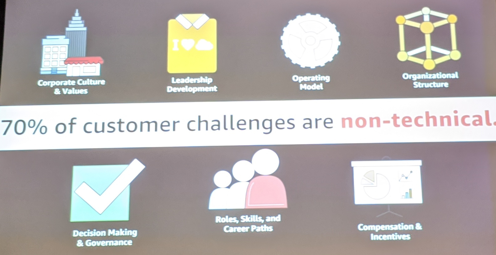

- culture & values
  - Have to build a narrative about how to make it successful in the organization
    - Understand _why_ the culture is why it is and appeal to that
  - Implement automation to reinforce (& codify) the cultural changes
- leadership development
  - Leadership has to level up
  - Need to figure out how to develop their staff
  - Figure out what it means to enable upskilling and developinging communities of practice
- Existing operating model
  - how work flows through functional-siloed teams is problematic
    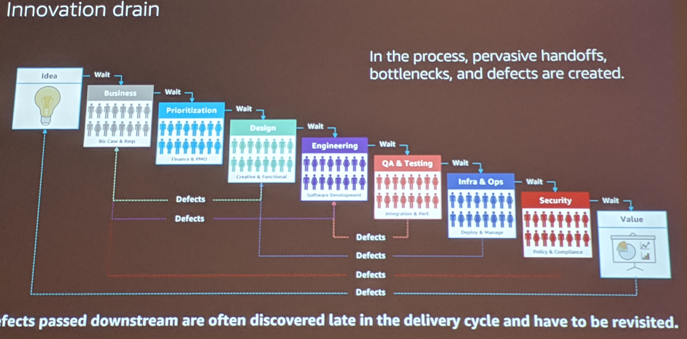
  - Appeal to the issues with the current system and contrast against fully-responsible team
- Security needs equal seat at table w/ org leadership
  - maybe not a head at the table, but at least equal concern
  - be the bar-raiser for security
    - build the culture from the get-go

### Selling the shift

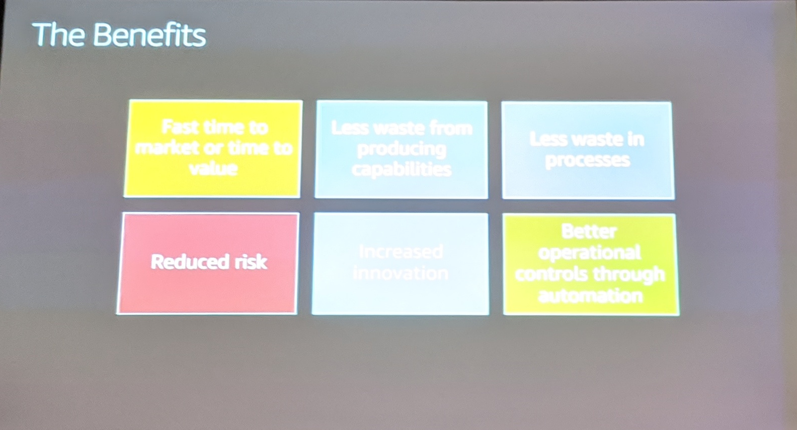

- frame as cultural transition for team...don't talk about implementation with senior leadership...will devolve into procurement discussion

devsecops achieved by integrating and automating the enforcement of preventitive, detective and responsive security controls into the pipeline

Tenets of DevSecOps

4. think big, start small --> automatically create a ticket when an alarm triggers

The Benefits

two-day doors:

determine kpis --> correlate release rate with revenue rates, error rates, etc.

traditional it teams

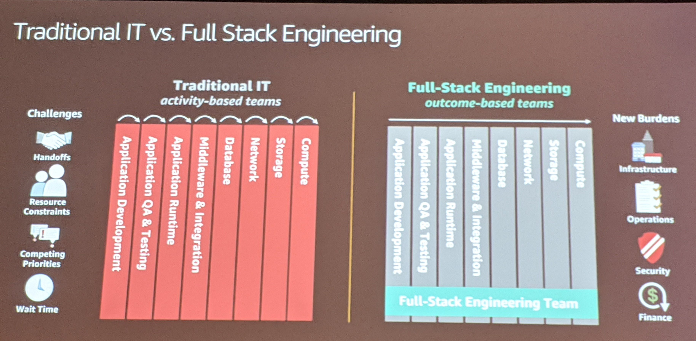

why teams existed:

- funding teams w/ mgrs with same skillsets
- chargebacks, etc.
- ability to understand and articulate why legacy culture/structure existed
  - what project are we going to delay to do this?
  - understand what the risks are and how to mitigate
  - take the aws approach: bulid the press release and FAQ first
    - HIPAA, PII, etc.

Innovation drain

- layout the structure of what needs to be changed

How to influence culture change?

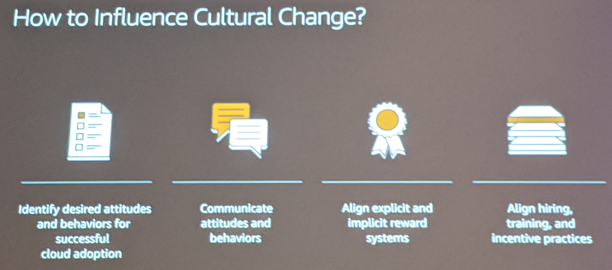

- write down the outcomes you want to achieve.
- How it works at AWS: not gating, consultancy from security
- Not everyone will be able to embed security on a team
  - automation will help here
- Incentives: give rewards for security. bake into perf reviews. make it a positive thing.

Driving change - Areas of focus

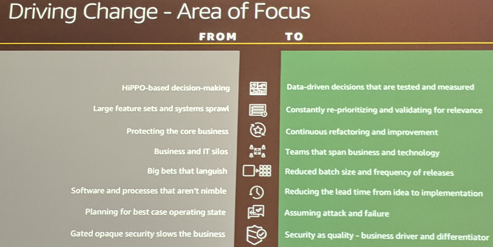

- Security = quality
  - treated the same way as defect
  - quality bar that you set security at
    - clear understanding of what the checklist is: articulate the value
      - safer for customer
      - platform to enable newer/safer/faster capabilities

Pitfalls

1. lack of executive sponsorship
   a. not just getting one team onboard. trying to holistically change org.
   a. OR just demonstrate iterative success. not as common.
1. poor communications
   a. across senior leadership, down from senior, what the business value is
   a. builders need to understand new requirements. may get upset, bypass, fight.
   a. how is going to make lives easier
   a. transparency - no black boxes
1. insufficient resource allocation
   a. related to first one. no money put down
   a. tie to existing transofmrational effort. e.g. to cloud, monolith to microservice, etc.
1. undefined kpis and outcomes
1. timing
1. "

What'd make it work at Amazon?

- Everyone's empowered. never hesitate to engage security.
- helps that culture was right from the getgo.
- security is a fewature of the service. insecure services @ AWS are not an option.

Cloud Center of Excellence (CCOE)

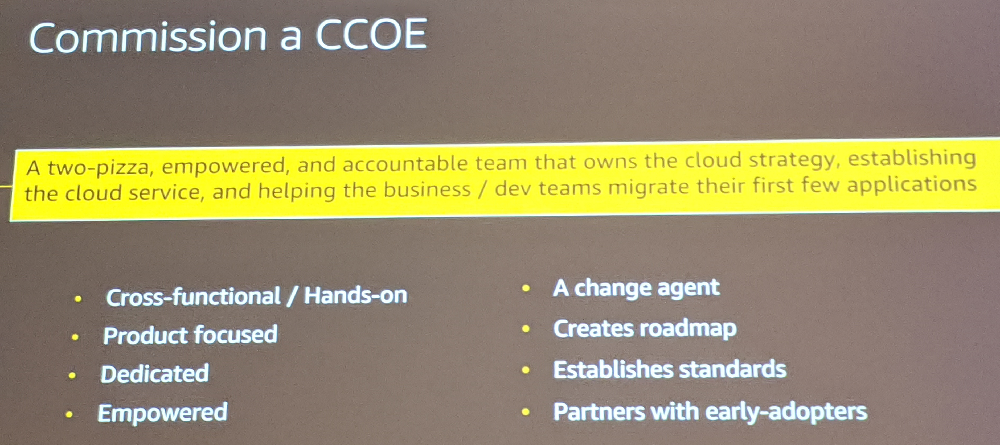

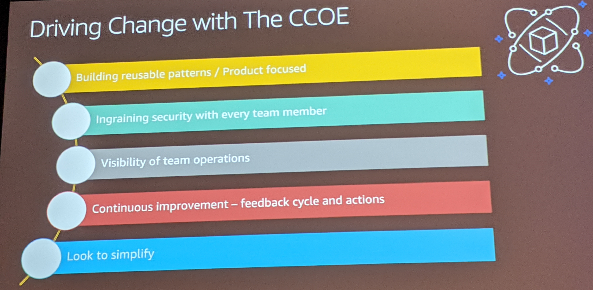

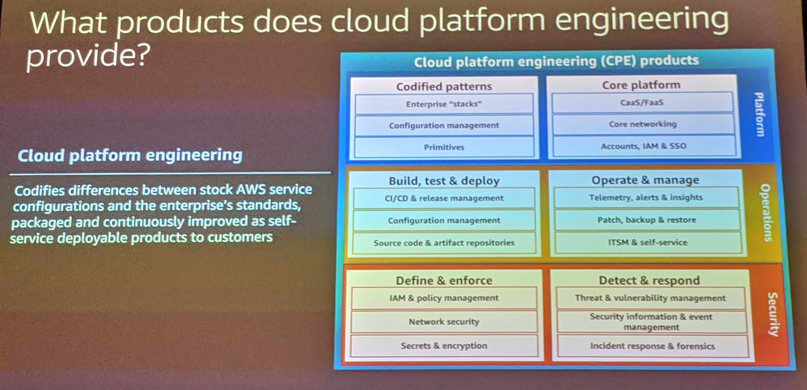

- sees across pipelines
- not as affiliated with _a_ team
- has execute sponsor

- Define the primitives and get them right. make them reusable.
  - wrap all this arround the application teams

Organizational change

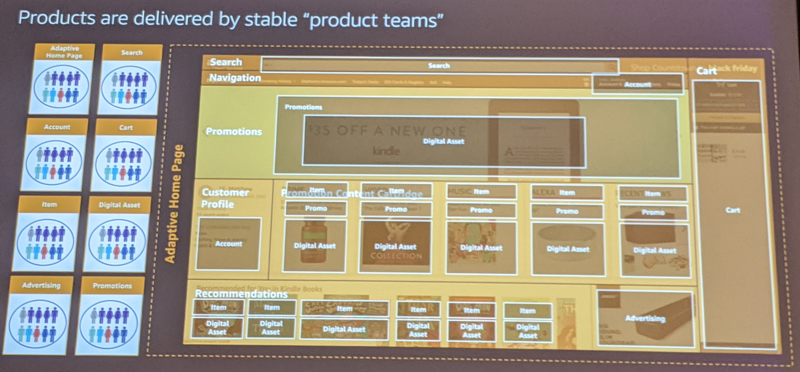

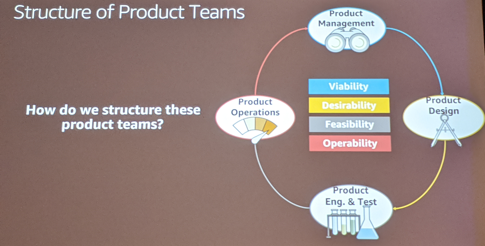

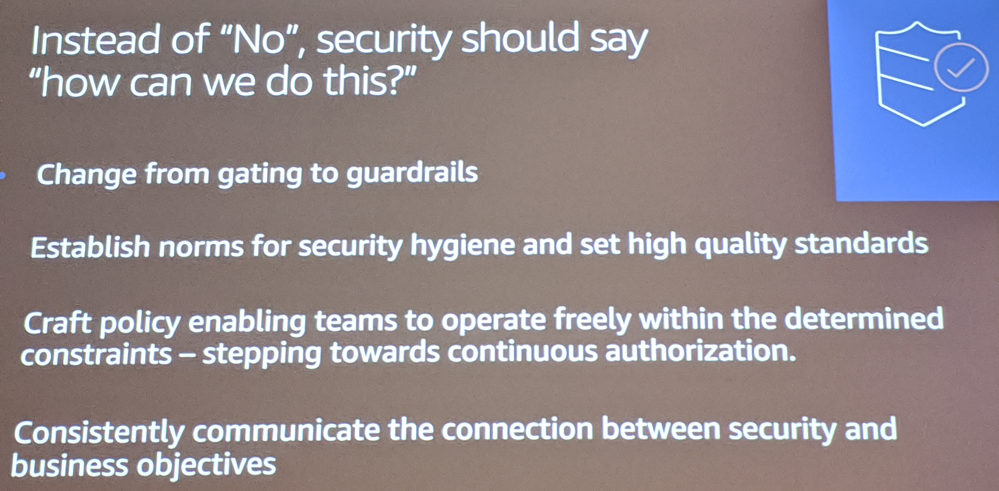

- Scurity: saying "no" is seen as a failure. what's your goal...how can we get you there?
  - Make security org think as builders

App sec reviews for our services

- how was your appsec review? good exp/bad exp?

security blind spots

- disparate sources - managing open source libs, partner products, languages, etc.
- lack of rigor
  - Automation can help to enforce rigor.
  - Use ticketing
- can't scale

"get humans away from your data"

Team interaction and workflow

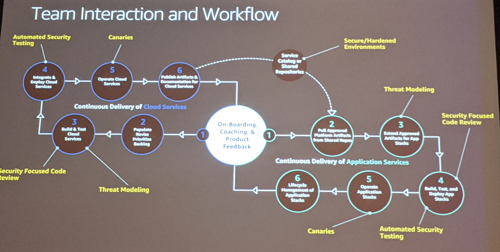

Left side represents CCOE, right is an application team
